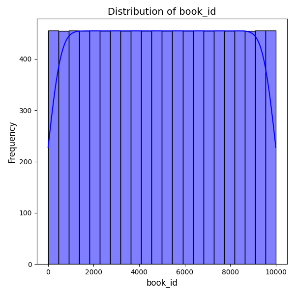
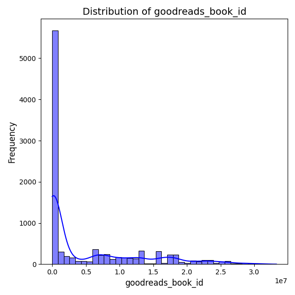

# Analysis Report

# Comprehensive Report on Book Dataset Analysis

## Introduction
This report presents an analysis of a dataset containing information about 10,000 books, including their ratings, authors, publication years, and other relevant attributes. The goal is to derive insights from the dataset and discuss their implications for stakeholders such as publishers, authors, and marketers.

## Dataset Overview
- **Shape**: (10000, 23)
- **Key Columns**: 
  - `book_id`, `goodreads_book_id`, `authors`, `original_publication_year`, `average_rating`, `ratings_count`, `work_text_reviews_count`, among others.
  
### Missing Values
The dataset has several columns with missing values:
- Missing `isbn` entries: 700
- Missing `isbn13` entries: 585
- Missing `original_publication_year`: 21
- Missing `original_title`: 585
- Missing `language_code`: 1084
- Missing `average_rating`: 0
- Notably, columns related to `isbn`, `original_title`, and `language_code` have significant missing entries that may affect analysis.

## Summary Statistics
### General Statistics
Key statistics for numeric columns indicate:
- **Average Rating**: Mean = 4.00, suggesting generally favorable reception.
- **Ratings Count**: Mean = 54,001, indicating a high level of engagement for some books.
- **Books Count**: Mean = 75.71, suggesting a wide range of works from various authors.

### Author Popularity
- The most frequently occurring author is **Stephen King**, with 60 entries, indicating his significant presence in this dataset.

### Publication Trends
- The mean `original_publication_year` is about 1982, with a notable range from as early as -1750 to 2017. This indicates a wide historical scope of the dataset.

## Correlation Analysis
### Key Correlations
- There is a strong negative correlation between `ratings_count` and `books_count` (-0.373); this suggests that books with a higher count of total books from an author may receive fewer ratings.
- A strong positive correlation exists between `work_ratings_count` and `ratings_count` (0.995), indicating that books with more reviews tend to receive more ratings.
  
### Implications
- Understanding these correlations can guide publishers in marketing strategies. For example, authors with a large number of works may need targeted promotional efforts to

